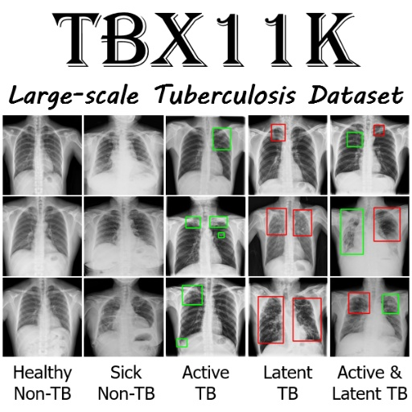
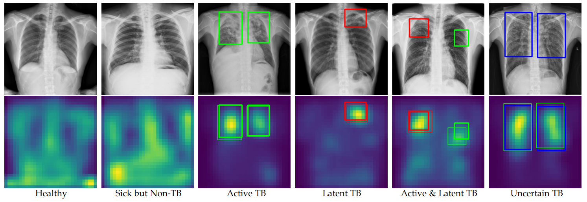

## [[TPAMI'2023] Revisiting Computer-Aided Tuberculosis Diagnosis](https://mmcheng.net/tb/)

This is the official repository for "Revisiting Computer-Aided Tuberculosis Diagnosis". 



### Introduction

Tuberculosis (TB) is a major global health threat, causing millions of deaths annually. Although early diagnosis and treatment can greatly improve the chances of survival, it remains a major challenge, especially in developing countries. Recently, computer-aided tuberculosis diagnosis (CTD) using deep learning has shown promise, but progress is hindered by limited training data. To address this, we establish a large-scale dataset, namely the **Tuberculosis X-ray (TBX11K)** dataset, which contains 11,200 chest X-ray (CXR) images with corresponding bounding box annotations for TB areas. This dataset enables the training of sophisticated detectors for high-quality CTD. Furthermore, we leverage the *bilateral symmetry property* of CXR images to propose a strong baseline, **SymFormer**, for simultaneous CXR image classification and TB infection area detection. To promote future research on CTD, we build a benchmark by introducing evaluation metrics, evaluating baseline models reformed from existing detectors, and running an online challenge.

This work extends the preliminary CVPR 2020 version ("Rethinking Computer-aided Tuberculosis Diagnosis", CVPR 2020, Oral) by proposing a novel SymFormer framework for CTD and validating its effectiveness with extensive experiments.

### Related Links

[[PDF]](https://yun-liu.github.io/papers/(TPAMI'2023)Revisiting%20Computer-Aided%20Tuberculosis%20Diagnosis.pdf)
[[Project Page]](https://mmcheng.net/tb/)
[[Dataset on Google Drive]](https://drive.google.com/file/d/1r-oNYTPiPCOUzSjChjCIYTdkjBTugqxR/view?usp=sharing)
[[Dataset on Baidu Yunpan]](https://pan.baidu.com/s/1INhqaZyPFKWPFXgynerXew)
[[Online Challenge]](https://codalab.lisn.upsaclay.fr/competitions/7916)
[[中译版]](https://yun-liu.github.io/materials/TPAMI2023_Tuberculosis_CN.pdf)

### Requirements:

* torch==1.9.0
* torchvision==0.10.0
* mmcv==1.3.12

Run `pip install -v -e .` to install this repository.

### TBX11K Dataset

**Summary of publicly available TB datasets.** The size of our dataset is about $17\times$ larger than that of the previous largest dataset. Besides, our dataset annotates TB infection areas with bounding boxes, instead of only image-level labels.

| Datasets      | Pub. Year   | #Classes | Annotations  | #Samples |
|---------------|-------------|----------|--------------|----------|
| MC            | 2014        | 2        | Image-level  | 138      |
| Shenzhen      | 2014        | 2        | Image-level  | 662      |
| DA            | 2014        | 2        | Image-level  | 156      |
| DB            | 2014        | 2        | Image-level  | 150      |
| TBX11K (Ours) | 2020 & 2023 | 4        | Bounding box | 11,200   |

**Split for the TBX11K dataset.** `Active & Latent TB` refers to CXR images with both active and latent TB; `Active TB` refers to CXR images with only active TB; `Latent TB` refers to CXR images with only latent TB; `Uncertain TB` refers to TB CXR images where the type of TB infection cannot be recognized using current medical conditions.

<table>
    <tr>
        <td></td>
        <td>Classes</td>
        <td>Train</td>
        <td>Val</td>
        <td>Test</td>
        <td>Total</td>
    </tr>
    <tr>
        <td rowspan="2">Non-TB</td>
        <td>Healthy</td>
        <td>3,000</td>
        <td>800</td>
        <td>1,200</td>
        <td>5,000</td>
    </tr>
    <tr>
        <td>Sick & Non-TB</td>
        <td>3,000</td>
        <td>800</td>
        <td>1,200</td>
        <td>5,000</td>
    </tr>
    <tr>
        <td rowspan="4">TB</td>
        <td>Active TB</td>
        <td>473</td>
        <td>157</td>
        <td>294</td>
        <td>924</td>
    </tr>
    <tr>
        <td>Latent TB</td>
        <td>104</td>
        <td>36</td>
        <td>72</td>
        <td>212</td>
    </tr>
    <tr>
        <td>Active & Latent TB</td>
        <td>23</td>
        <td>7</td>
        <td>24</td>
        <td>54</td>
    </tr>
    <tr>
        <td>Uncertain TB</td>
        <td>0</td>
        <td>0</td>
        <td>10</td>
        <td>10</td>
    </tr>
    <tr>
        <td colspan="2">Total</td>
        <td>6,600</td>
        <td>1,800</td>
        <td>2,800</td>
        <td>11,200</td>
    </tr>
</table>

### SymFormer

#### CXR image classification results on the TBX11K test data.

| Methods                      | Backbones        | Accuracy | AUC (TB) | Sensitivity | Specificity | AP   | AR   | Result |
|------------------------------|------------------|----------|----------|-------------|-------------|------|------|--------|
| Deformable DETR              | ResNet-50 w/ FPN | 91.3     | 97.6     | 89.2        | 95.3        | 89.8 | 91.0 | [[JSON]](resources/result_files/Deformable.json) [[TXT]](resources/result_files/Deformable.txt) |
| SymFormer w/ Deformable DETR | ResNet-50 w/ FPN | 94.3     | 98.5     | 87.3        | 97.3        | 93.2 | 93.2 | [[JSON]](resources/result_files/SymFormer_Deformable.json) [[TXT]](resources/result_files/SymFormer_Deformable.txt) |
| SymFormer w/ RetinaNet       | ResNet-50 w/ FPN | 94.5     | 98.9     | 91.0        | 96.8        | 93.3 | 94.0 | [[JSON]](resources/result_files/SymFormer_RetinaNet_R50.json) [[TXT]](resources/result_files/SymFormer_RetinaNet_R50.txt) |
| SymFormer w/ RetinaNet       | P2T-Small w/ FPN | 94.6     | 99.1     | 92.1        | 96.7        | 93.4 | 94.2 | [[JSON]](resources/result_files/SymFormer_RetinaNet_P2T.json) [[TXT]](resources/result_files/SymFormer_RetinaNet_P2T.txt) |

TP: True Positives; TN: True Negatives; FP: False Positives; FN: False Negatives. 

`#Total` denotes the total number of test CXR images. We test FPS on a single TITAN XP GPU. For the ground truths, the ratio of positives (TP + FN) is 19.6%, and the ratio of negatives (TN + FP) is 80.4%.

| Methods                      | Backbones        | #FLOPs | #Params | FPS  | $F_1$ | TP/#Total | TN/#Total | FP/#Total | FN/#Total |
|------------------------------|------------------|--------|---------|------|-------|-----------|-----------|-----------|-----------|
| Deformable DETR              | ResNet-50 w/ FPN | 54.07  | 52.67   | 23.0 | 85.6  | 17.5      | 76.6      | 3.8       | 2.1       |
| SymFormer w/ Deformable DETR | ResNet-50 w/ FPN | 54.08  | 52.69   | 22.5 | 87.9  | 17.1      | 78.2      | 2.2       | 2.5       |
| SymFormer w/ RetinaNet       | ResNet-50 w/ FPN | 59.14  | 50.03   | 24.3 | 89.0  | 17.8      | 77.8      | 2.6       | 1.8       |
| SymFormer w/ RetinaNet       | P2T-Small w/ FPN | 55.46  | 45.10   | 17.9 | 89.6  | 18.1      | 77.7      | 2.7       | 1.5       |


#### TB infection area detection results on our TBX11K test set.

<table>
    <tr>
        <td rowspan="2">Methods</td>
        <td rowspan="2">Test Data</td>
        <td rowspan="2">Backbones</td>
        <td colspan="2">Category-agnostic TB</td>
        <td colspan="2">Active TB</td>
        <td colspan="2">Latent TB</td>
    </tr>
    <tr>
        <td>AP<sup>50</sup><sub style="margin-left:-13px">bb</sub></td>
        <td>AP<sub>bb</sub></td>
        <td>AP<sup>50</sup><sub style="margin-left:-13px">bb</sub></td>
        <td>AP<sub>bb</sub></td>
        <td>AP<sup>50</sup><sub style="margin-left:-13px">bb</sub></td>
        <td>AP<sub>bb</sub></td>
    </tr>
    <tr>
        <td>Deformable DETR</td>
        <td rowspan="4">ALL</td>
        <td>ResNet-50 w/ FPN</td>
        <td>51.7</td>
        <td>22.0</td>
        <td>48.9</td>
        <td>21.2</td>
        <td>7.1</td>
        <td>1.9</td>
    </tr>
    <tr>
        <td>SymFormer w/ Deformable DETR</td>
        <td>ResNet-50 w/ FPN</td>
        <td>57.0</td>
        <td>23.3</td>
        <td>52.1</td>
        <td>22.7</td>
        <td>7.1</td>
        <td>2.0</td>
    </tr>
    <tr>
        <td>SymFormer w/ RetinaNet</td>
        <td>ResNet-50 w/ FPN</td>
        <td>68.0</td>
        <td>29.5</td>
        <td>62.0</td>
        <td>27.3</td>
        <td>13.3</td>
        <td>4.4</td>
    </tr>
    <tr>
        <td>SymFormer w/ RetinaNet</td>
        <td>P2T-Small w/ FPN</td>
        <td>70.4</td>
        <td>30.0</td>
        <td>63.6</td>
        <td>26.9</td>
        <td>11.4</td>
        <td>4.3</td>
    </tr>
    <tr>
        <td>Deformable DETR</td>
        <td rowspan="4">Only TB</td>
        <td>ResNet-50 w/ FPN</td>
        <td>57.4</td>
        <td>24.2</td>
        <td>54.5</td>
        <td>23.5</td>
        <td>7.6</td>
        <td>2.3</td>
    </tr>
    <tr>
        <td>SymFormer w/ Deformable DETR</td>
        <td>ResNet-50 w/ FPN</td>
        <td>60.8</td>
        <td>24.5</td>
        <td>55.2</td>
        <td>23.8</td>
        <td>9.2</td>
        <td>2.6</td>
    </tr>
    <tr>
        <td>SymFormer w/ RetinaNet</td>
        <td>ResNet-50 w/ FPN</td>
        <td>73.4</td>
        <td>31.5</td>
        <td>67.1</td>
        <td>29.2</td>
        <td>14.7</td>
        <td>4.8</td>
    </tr>
    <tr>
        <td>SymFormer w/ RetinaNet</td>
        <td>P2T-Small w/ FPN</td>
        <td>75.7</td>
        <td>32.1</td>
        <td>68.9</td>
        <td>28.9</td>
        <td>13.0</td>
        <td>4.7</td>
    </tr>
</table>

### Visualization



**Visualization of the learned deep features from CXR images using SymFormer w/ RetinaNet.** We randomly select CXR images from the TBX11K test set. In each example, the infection areas of active TB, latent TB, and uncertain TB are indicated by boxes colored in green, red, and blue, respectively. The ground-truth boxes are displayed with thick lines, while the detected boxes are shown with thin lines.

### Train

Here, we show the training/testing commands by using P2T-Small as the backbone network and RetinaNet as the base detector.

Download the ImageNet-pretrained model first: [P2T-Small](https://drive.google.com/file/d/1FlwhyVKw0zqj2mux248gIQFQ8DGPi8rS/view?usp=sharing).

Use the following commands to train `SymFormer`:

```bash
# step I: train detection
CUDA_VISIBLE_DEVICE=0 python tools/train.py \
    configs/symformer/symformer_retinanet_p2t_fpn_2x_TBX11K.py \
    --work-dir work_dirs/symformer_retinanet_p2t/ \
    --no-validate

# step II: train classification
CUDA_VISIBLE_DEVICES=0 python tools/train.py \
    configs/symformer/symformer_retinanet_p2t_cls_fpn_1x_TBX11K.py \
    --work-dir work_dirs/symformer_retinanet_p2t_cls/ \
    --no-validate
```

### Test

Use the following commands to generate results for the TBX11K test set:

```bash
CUDA_VISIBLE_DEVICES=0 python -W ignore tools/test.py \
    configs/symformer/symformer_retinanet_p2t_cls_fpn_1x_TBX11K.py \
    work_dirs/symformer_retinanet_p2t_cls/latest.pth \
    --out work_dirs/symformer_retinanet_p2t_cls/result/result.pkl \
    --format-only --cls-filter True \
    --options "jsonfile_prefix=work_dirs/symformer_retinanet_p2t_cls/result/bbox_result" \
    --txt work_dirs/symformer_retinanet_p2t_cls/result/cls_result.txt
```

### Online Challenge

We only release the ground truths for the training and validation sets of our TBX11K dataset. The test set is retained as an online challenge for TB X-ray classification and TB infection area detection. To participate this challenge, you need to create an account on [CodaLab](https://codalab.lisn.upsaclay.fr/) and register for the [TBX11K Tuberculosis Classification and Detection Challenge](https://codalab.lisn.upsaclay.fr/competitions/7916). Please refer to this [webpage](https://codalab.lisn.upsaclay.fr/competitions/7916#learn_the_details-evaluation) or our paper to see the evaluation metrics. Then, open the "Participate" tab to read the [submission guidelines](https://codalab.lisn.upsaclay.fr/competitions/7916#participate) carefully. Next, you can upload your submission. Once uploaded, your submissions will be evaluated automatically.


### Citation

If you are using the code/model/data provided here in a publication, please consider citing our papers:

```
@article{liu2023revisiting,
  title={Revisiting Computer-Aided Tuberculosis Diagnosis},
  author={Liu, Yun and Wu, Yu-Huan and Zhang, Shi-Chen and Liu, Li and Wu, Min and Cheng, Ming-Ming},
  journal={IEEE Transactions on Pattern Analysis and Machine Intelligence},
  year={2023}
}

@inproceedings{liu2020rethinking,
  title={Rethinking Computer-aided Tuberculosis Diagnosis},
  author={Liu, Yun and Wu, Yu-Huan and Ban, Yunfeng and Wang, Huifang and Cheng, Ming-Ming},
  booktitle={IEEE/CVF Conference on Computer Vision and Pattern Recognition},
  pages={2646--2655},
  year={2020}
}
```

This repository exemplifies the training/testing commands by using P2T-Small as the backbone network and RetinaNet as the base detector:

```
@article{wu2022p2t,
  title={P2T: Pyramid Pooling Transformer for Scene Understanding},
  author={Wu, Yu-Huan and Liu, Yun and Zhan, Xin and Cheng, Ming-Ming},
  journal={IEEE Transactions on Pattern Analysis and Machine Intelligence},
  volume={45},
  number={11},
  pages={12760--12771},
  year={2023},
  publisher={IEEE}
}

@inproceedings{lin2017focal,
  title={Focal Loss for Dense Object Detection},
  author={Lin, Tsung-Yi and Goyal, Priya and Girshick, Ross and He, Kaiming and Doll{\'a}r, Piotr},
  booktitle={IEEE International Conference on Computer Vision},,
  pages={2980--2988},
  year={2017}
}
```

